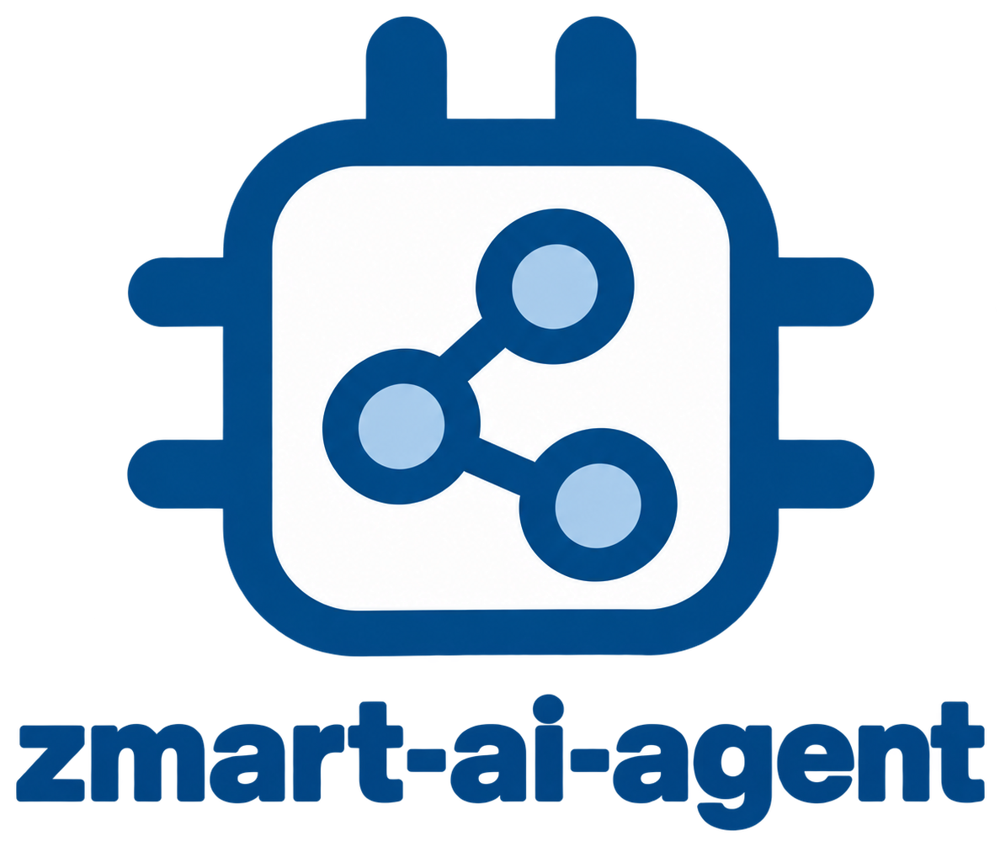

# ZMART AI agent

[](https://www.python.org/downloads/)
[](LICENSE)
[](#testing)
[](#status)



The **ZMART AI agent** lets you drive a microscope by asking for things in your own words, in a chat window.
It works on any microscope that has a ZMART driver, because it drives the microscope only through the [ZMART Controller](https://github.com/thomdehoog/ZMART-controller).
It is part of [**ZMART**](https://github.com/thomdehoog/ZMART-microscopy) (ZMB's Microscopy-Agnostic Research Toolkit), the tools we use for smart microscopy
at the Center for Microscopy and Image Analysis (ZMB), University of Zurich.
<br clear="left"/>

## The Problem

Driving a microscope from code means learning its software, its names for settings and its
limits, and an agent built for one microscope knows nothing about the next. A language model
can understand what an operator asks for, but left to itself it may guess at settings, act
without asking, or claim to have done things it never did.

## The Solution

A language model (Gemini by default; OpenAI, a server of your own or a model file on this
computer also work) carries out what you ask with the microscope and explains what it did.

The model never touches the microscope directly. It can only call a small set of tools written
here, and every tool checks what it is asked before acting. Each tool is a few commands of the
ZMART Controller (`get_xyz`, `set_xyz`, `get_state`, `set_state`, `acquire`, `run_procedure`,
...), and the microscope's driver carries them out. The driver keeps the travel limits, the
origin and the calibration, and it refuses what is not safe; the agent passes its refusals
on in plain words.

**The agent knows nothing about a microscope in advance.** When it connects, it asks the
driver what this microscope is and what it can do, using the commands every ZMART driver
answers anyway:

| It asks | And learns |
|---|---|
| `get_info` | the microscope described in plain words by its driver, and where images are saved |
| `get_actuators`, `get_xyz` | the axes and their motors; for each axis its position in micrometres from the origin, the raw reading of every motor, and the canvas: everywhere a picture can show along it, a little wider than the stage's travel |
| `get_state` | the settings that can be changed, by the driver's own names, and the read-only report (objective, pixel size, ...) |
| `get_acquisition_settings` | the acquisition settings, the choices for acquiring (for example a z-stack, or a folder for the files), with their allowed values |
| `get_procedures` | the routines the microscope offers, such as autofocus, each with a description |

From the answers it writes the "This microscope" part of the model's instructions. The rest of
the instructions is the same for every microscope: who you are (a biologist, so plain words), the
ZMART vocabulary, the units, and the safety rules. So the controller is not shaped around the
agent; a driver that answers the ZMART commands is all it needs.

The description in `get_info` is optional for a driver (see the controller's
[driver guide](https://github.com/thomdehoog/ZMART-controller/blob/main/docs/plug_in_a_driver/README.md)). Without
it, the agent still connects and works from the other answers, and both the window and the
model are told that the driver gives no description: the agent then knows the settings by
name, but not what they mean or in which unit.

With every message, the model also gets a fresh reading of the microscope (the position, the
settings, the read-only report, the clock, the schedules, the frames seen so far with the map
made from them, and the request the turn belongs to), marked as an instrument reading that is
never an instruction.

**Directions.** Every ZMART driver keeps one rule for x and y: the positions and the saved
images share the frame in which you observe the specimen, so in a saved image right is +x and
down is +y, on every microscope, and the window shows the image the same way. So *go 100 um to
the left* is a move to -x, without anything to set up. Which way +z points is the microscope's
own, so which way is *deeper* or *toward the coverslip* comes from the driver's description;
when the description does not say, the agent asks you once.

## Try it yourself

On the microscope computer, the ZMART Controller and the microscope's driver come first (see
the controller's [guide to plugging in a driver](https://github.com/thomdehoog/ZMART-controller/blob/main/docs/plug_in_a_driver/README.md):
a driver is installed once with `zmart_controller.register_driver`, and the controller lists
it by the name in its `zmart_driver.json`). Then, in the same Python environment:

```
pip install "git+https://github.com/thomdehoog/ZMART-controller"
pip install -e .
```

One command opens the window:

```
zmart-ai-agent
```

`python -m zmart_ai_agent` does the same. Without anything else, it connects to `mock`, the
pretend microscope that comes with the controller, to try the agent on without hardware.

Name an installed driver with `--driver`, and give what it needs to connect beyond what was
saved with it, if anything, with `--connection` as JSON (the driver's README says which
entries it takes):

```
zmart-ai-agent --driver my-scope
zmart-ai-agent --driver my-scope --connection "{\"password\": \"...\"}"
```

The **Driver** box at the top of the window offers the installed drivers by name; choose
another one and press Connect to switch microscopes, which starts the conversation afresh.
What is given with `--connection` is never shown in the window or to the model, since it may
hold a password. `--font-size 13` makes the letters bigger (the default is 11), and the divider
between the chat and the image can be dragged.

Images are saved where the driver saves them (its `output_root`, which the window names when it
connects). Each acquisition is saved by the driver as OME-TIFF or OME-Zarr, and the agent
reads the files back to show them and to look at them.

### Choosing the model

The **Model** line folds open to the choice. A cloud model needs an API key, which you type into
the panel; it stays in memory for this session only and is never written anywhere. Each message
costs a small amount; the provider's pricing page says how much.

| Provider | Default model | Key from |
|---|---|---|
| Gemini | `gemini-3.5-flash-lite` (generous free tier) | [aistudio.google.com](https://aistudio.google.com) |
| OpenAI | `gpt-5-mini` | [platform.openai.com](https://platform.openai.com) |
| OpenAI-style server | `gemma4:31b` at `http://localhost:11434/v1` | none, unless the server asks |

Press *Use this model*; the conversation so far is kept. A key can also come from the
environment (`GEMINI_API_KEY`, `OPENAI_API_KEY`): the panel then says so, and the field can stay
empty. `--model openai:gpt-5-mini` on the command line starts with that choice. OpenAI (and an
OpenAI-style server) needs its library: `pip install -e ".[openai]"`.

An **OpenAI-style server** is anything that speaks the OpenAI chat API: Ollama, vLLM, LM Studio,
or a gateway at your institute. Tick *Can see images* when its model can look at pictures. Such
a server must allow requests of about 7,000 tokens; Ollama does not by default (set
`OLLAMA_CONTEXT_LENGTH=16384`).

A **file on this computer** (`.gguf`, from Hugging Face) is served by the window itself, with no
internet at all: `pip install "llama-cpp-python[server]"`, put the file in
`zmart_ai_agent_models` in your home folder (or choose another folder in the panel), pick it and
press *Use this model*. A model can see images when its projector file (`mmproj` in the name)
sits next to it. Small models make more mistakes with the tools.

The **Vision model** box names the model shown camera images; by default it is the same one.

Things to try: *Where is the stage?* · *What do you see?* · *Is it in focus?* · *Find focus* ·
*Set the exposure to 50 ms* · *Centre the bright spot* · *Take a z-stack of 5 planes, 2 um
apart, here* · *Image these three positions with laser power 5 and 20* · *Move 100 um to the
left* · *Is it sharper than frame 3?* · *What does this setting do?* · *How does a move reach
the microscope? Show me the code* · *Look every three minutes and tell me whether it drifts* ·
*Let it settle for two minutes, then look again*

### What it can do

| Tool | What it does | Controller commands |
|---|---|---|
| `check_setup` | names the chosen driver and connects (again) to its microscope, with the steps for you when that fails | connecting, and the readings above |
| `get_status` | reads the position and the state | `get_xyz`, `get_state` |
| `move_stage` | moves to an absolute position, optionally with a named motor, and reports the position read back after the move | `get_xyz`, `set_xyz` |
| `set_microscope` | changes settings, by the names the driver lists as changeable | `get_state`, `set_state` |
| `focus` | runs the microscope's own focus routine (one whose name holds "focus"), at once | `get_procedures`, `run_procedure` |
| `run_procedure` | runs any routine the microscope lists, after your go-ahead | `get_procedures`, `run_procedure` |
| `look` | acquires one image here, keeps it as a numbered frame, and asks the eyes about it, with earlier frames to compare when named | `acquire` |
| `ask_eyes` | asks about the frames already seen, without a new one | (none) |
| `calibrate` | measures how the picture moves when the stage moves, after your go-ahead, and keeps it per objective | `set_xyz`, `acquire` |
| `plan_acquisition` | checks a plan against the microscope without moving | `get_xyz`, `get_state`, `get_acquisition_settings` |
| `run_acquisition` | runs a checked plan, after your go-ahead | `set_xyz`, `set_state`, `acquire` |
| `schedule`, `cancel_schedule` | sets or cancels an instruction for later | (none) |
| `wait` | ends the turn and lets the request go on by itself after a pause | (none) |
| `search_source`, `read_source` | searches and reads the source of this agent, of the controller and of the connected microscope's driver | (none) |

Every tool that changed something ends its answer with `state_changed`: the position and
settings that differ from what the model last saw. So the model knows what a routine or a run
did to the microscope without reading it again.

**A plan** is deliberately simple, so that it means the same on every microscope: positions,
channels and time points, with one acquisition for each combination. A channel is a short name
and the settings to apply before imaging it, by the driver's own setting names. Anything an
acquisition itself can do, such as a z-stack, is one of the driver's acquisition settings, given
for the whole plan or per channel. Each acquisition is saved under a position label made from
the position, channel and time point names, so the files sort the way the run went. The run goes time point by
time point, position by position, and channel by channel; the driver saves every acquisition,
shows each image in the window and keeps it as a frame, and the answer lists the files and
describes the last image.

**Frames and the map.** Every image a look or a run delivers is kept for the session as a
numbered frame: a small copy of the picture, its time, where it was taken (position and
settings), an optional label, and the measured numbers. The numbers that matter for driving are
how bright and how sharp the image is, where the bright signal sits and how far that is from the
centre, in pixels and, when the driver reports its pixel size, in micrometres, and
`centre_move_um`: the stage move in x and y that would bring the signal to the centre. That move
follows from the frame rule above, so it needs nothing set up.

A look can name earlier frames
(*last 3*, *1,7*, *3-10*, or a label): the eyes are shown them with the new one, and the answer measures how
far the picture shifted between them (by phase correlation, a standard way of finding the shift
between two pictures of the same scene) and how the sharpness and the brightness changed. A
label (*before*) finds a frame again. The microscope state carries the frames in brief and a
map derived from them: where the stage would centre the sample, the best focus from the frames
taken at the same place (the top of a curve through the sharpest frame and its neighbours in
z), with how old that is, and the labelled places.

**Calibrate.** A driver whose camera registration has not been measured yet saves its pictures
turned or mirrored, whatever the rule says; the controller's mock as shipped is one, until its
setup is done. `calibrate`, agreed with you first, takes an image, moves the stage a small step
in x and back, then in y and back, with an image at each stop, and measures how the picture
really moved. The answer is kept per microscope and objective in `zmart-ai-agent/calibration.json`
under the computer's ZMART configuration folder, and from then on the frames' centring move and
the map use it (the frame says `"scale": "measured"` instead of `"nominal"`). The report also
says whether the pictures follow the frame rule, which is a check on the driver's setup.

**The eyes.** The vision model has a conversation of its own for the session: every look is a
turn in it, with the frames it shows, each with its number, time, position, settings and
numbers, and the question. Once answered, a turn keeps its words and loses its pictures, so a
look costs the frames it shows and no more; to compare with an older frame, a look names it and
it is shown again from the frame history. A z-stack is shown as its maximum projection. Beyond
forty looks the oldest turns are dropped.

**Schedules.** *Look every three minutes and tell me whether anything changed*: the agent
sets a named schedule, and the window's clock sends each due instruction as a turn of its own,
shown as a muted line in the chat, through the same tools and checks as anything you type.
Above the input line, each schedule has a row of its own with how often it fires and a countdown
to its next firing, and a **Cancel schedule** button that ends that one alone. A scheduled
acquisition, routine or long move still asks for your go-ahead and waits until you answer. At
most ten schedules, none more often than every five seconds. *Stop microscope* and *Clear
context* cancel them all.

**Requests and waiting.** What one message of yours sets going is a request, and its scheduled
and continued turns belong to it. For a request with several steps the agent begins its reply
with a checklist and ticks the steps off as they are done; the request line above the input
shows the open request, its turns and tokens, what it waits for, and that plan, with a **Cancel
request** button. *Let it settle for two minutes, then look again*: the agent calls `wait`, the
turn ends, and when the time is up the window continues the request in a turn of its own, shown
as a muted line, through the same tools and checks. Once a turn has asked to wait it may not
touch the microscope again; one wait is pending at a time, at most four hours long, and a
request continues at most thirty times. Cancel request, Stop microscope and Clear context end
it.

### How it stays safe

- **Checks before acting.** A move is checked against the canvas the driver reports (a
  position outside it is certainly out of reach), a setting against the names the driver lists
  as changeable, and a plan against both and the acquisition settings. Then the driver checks
  again, against its own travel limits, and refuses a move beyond them.
- **Refusals come with advice.** A refused or failed action comes back to the agent with
  what was refused, why (in the driver's own words), and what to do next. After a limit it is
  told to stop and leave the next number to you, rather than try a nearby value. When a name is
  not known (a setting, a routine, an acquisition setting), the refusal lists the microscope's own names.
- **A red banner for refusals.** A limit or an invalid value is also shown in the window
  directly, whatever the agent says.
- **Big steps are agreed in the chat first.** Starting an acquisition, running a routine other
  than focus, calibrating, and a stage move of more than 1 mm in XY or 100 um in Z wait for you:
  the agent asks, and the step can run only after your reply. Moves are measured from where the
  stage was when you last wrote, so small steps that add up also ask. A scheduled or continued
  turn is never your reply. That the question comes first is in the code, not only in the
  model's instructions.
- **One action at a time,** so each result is seen before the next action.
- **Two checks on the reply.** An empty reply goes back to the model once. A reply that claims
  to have done something in a turn that called no tool also goes back once, with that fact.
- **Cancel prompt** stops the agent: every further tool call in that turn does nothing.
  **Stop microscope** also ends a running acquisition after the image being taken, and drops
  every schedule and the open request. A single move or image the driver has already started
  runs to its end, since the ZMART vocabulary has no command to interrupt it; the microscope's
  own controls stop it sooner. The window does not close while the agent is still working.
- **Clear context** forgets the conversation, the frames and the eyes' looks; **Show tool
  calls** lists each tool call in the chat as it happens. Choosing another microscope also
  starts the conversation afresh.

To keep long conversations quick, the agent forgets older messages: after 15 of your
messages it keeps the newest 10.

### Status

This is a release candidate. It is a port of the Nikon chat assistant onto the ZMART
Controller, with the newer ideas of the mesoSPIM assistant folded in (see below), and so far it
has been tried on the controller's mock microscope only, not yet on a real one. The offline
tests pass (172). The evaluation with a real model was last run before the frames, the
calibration and the requests were added; its cases still hold, and the next run with Gemini
3.5 Flash-Lite will say how that model takes to the new tools.

## Testing

The tests drive the mock microscope that comes with ZMART-controller (`zmart_controller.mock`)
through the real controller, with a scripted model in place of the real one, so they need
neither a microscope nor an API key.

```
pip install -e ".[test]"
pytest                                    # offline, about 15 s
ruff check . && ruff format --check .     # lint and formatting, rules in pyproject.toml
```

### For maintainers: the evaluation

The tests check the code. Whether the agent does what an operator expects (acts when a
request is clear, asks when it is not, stops at a limit, ignores instructions hidden in the
data) depends on the model, and is checked by the evaluation. It runs every case in
`tests/eval_cases.json` through the real agent, with a real model and the mock microscope,
and scores the result. Each run costs API calls. Without a key (or, for a server of your own,
without a server that answers) it says so and stops.

```
python tests/evals.py --model openai:gpt-5-mini                # needs OPENAI_API_KEY
python tests/evals.py --model google:gemini-3.5-flash-lite     # needs GEMINI_API_KEY
python tests/evals.py --holdout --repeat 3                     # other wording; shows cases that pass only sometimes
python tests/evals.py --scoreboard evals-*.jsonl               # pass rates per model and per category
```

Change the instructions while looking at `eval_cases.json` only, then check with `--holdout`:
that shows whether a change made the agent better, or only fitted it to the cases.

## Files

| File | What it is |
|---|---|
| `zmart_ai_agent/tools.py` | The list of tools, with `check_setup` and `get_status`. The place to look a tool up. |
| `zmart_ai_agent/tooling.py` | What every tool shares: the checks around a tool, its refusals, the go-ahead rule, and `state_changed`. |
| `zmart_ai_agent/moving.py` | `move_stage`, and the checks around a move. |
| `zmart_ai_agent/adjusting.py` | `set_microscope`, `focus` and `run_procedure`. |
| `zmart_ai_agent/looking.py` | `look`, `ask_eyes` and `calibrate`, and describing an image. |
| `zmart_ai_agent/acquiring.py` | `plan_acquisition`, `run_acquisition`, and one run of a plan. |
| `zmart_ai_agent/later.py` | `schedule`, `cancel_schedule` and `wait`. |
| `zmart_ai_agent/source.py` | `search_source` and `read_source`. |
| `zmart_ai_agent/guards.py` | The two guards on the model's reply itself. |
| `zmart_ai_agent/microscope.py` | The connection through the ZMART Controller, what the agent learns at connect, the "This microscope" section it writes from that, and the session's side: the frames, the schedules, the requests, the eyes. |
| `zmart_ai_agent/frames.py` | The frames seen this session with their measures, the shift between two pictures, the calibration, and the map. |
| `zmart_ai_agent/requests.py` | The requests: what one typed message set going, and the wait that continues it. |
| `zmart_ai_agent/schedules.py` | The schedules the agent sets, when each is due, and the agent's one clock. |
| `zmart_ai_agent/instructions.py` | The prose the model reads: the generic instructions, the frame of the microscope section, the advice given with a refusal, and the setup steps it passes on. |
| `zmart_ai_agent/plans.py` | The plan format, the order a plan runs in, and the plan in plain sentences. |
| `zmart_ai_agent/images.py` | The saved files read back (OME-TIFF and OME-Zarr), their numbers (brightness, saturation, sharpness, where the signal sits), the small copy a frame keeps, and the PNG for the model. |
| `zmart_ai_agent/eyes.py` | The vision model's own conversation: the frames shown to it, compared on request. |
| `zmart_ai_agent/memory.py` | The conversation made smaller now and then. |
| `zmart_ai_agent/models.py` | The ways to reach a model: a provider preset, an API key held in memory, the model object. |
| `zmart_ai_agent/local.py` | A `.gguf` model file served on this computer by llama.cpp. |
| `zmart_ai_agent/agent.py` | The assembly: the Pydantic AI `Agent` with the tools and guards, and `Conversation`, one conversation with the microscope. |
| `zmart_ai_agent/settings.py` | Every constant: the provider presets, go-ahead distances, frame and map limits, memory sizes, window defaults. |
| `zmart_ai_agent/window.py` | The chat window (`zmart-ai-agent`), with the Model panel from `panel.py` and the request bar and schedule rows from `bars.py`. |
| `tests/evals.py` | The evaluation with a real model; `eval_cases.json` and `eval_cases_holdout.json`. |

## Where it came from

This is the Nikon NIS-Elements chat assistant (`nis_assistant`), ported onto the ZMART
Controller. Everything that belonged to one microscope or to useq is gone: the NIS bridge and
engine, useq sequences and pymmcore-plus, the stage-limit fields (the driver keeps the limits),
and the coordinate-system box (ZMART drivers line their images up with their frame). The tools,
the safety machinery, the eyes, the schedules, the memory and the model choice carried over.

The frames and the map, the calibration, the requests with `wait` and the plan checklist, the
schedule rows, the one clock, `state_changed` and the sharpness measure came over from the
mesoSPIM AI assistant ([mesoSPIM-control pull request 120](https://github.com/mesoSPIM/mesoSPIM-control/pull/120)),
reshaped for the ZMART vocabulary: there the centring move needed a coordinate-system box, here
it follows from the frame rule, and a turn here waits for time only, since every acquisition
runs to its end inside its tool. Its "measured values", which let a move pass without the
operator's go-ahead when it follows from a fresh measurement, were left out: here a move only
asks when it is long, and a centring move within one field of view never is.

## Author
Thom de Hoog, Center for Microscopy and Image Analysis (ZMB), University of Zurich
(thom.dehoog@zmb.uzh.ch, thomdehoog@gmail.com).

## License
MIT License. See LICENSE file for details.

## Links

- [ZMART Microscopy](https://github.com/thomdehoog/ZMART-microscopy): the main repository, with the workflows and the drivers
- [ZMART Controller](https://github.com/thomdehoog/ZMART-controller): the vocabulary this agent speaks, and the mock microscope its tests use
- [Center for Microscopy and Image Analysis (ZMB)](https://www.zmb.uzh.ch), University of Zurich
